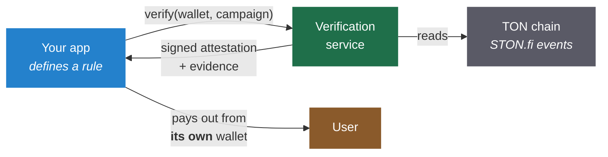
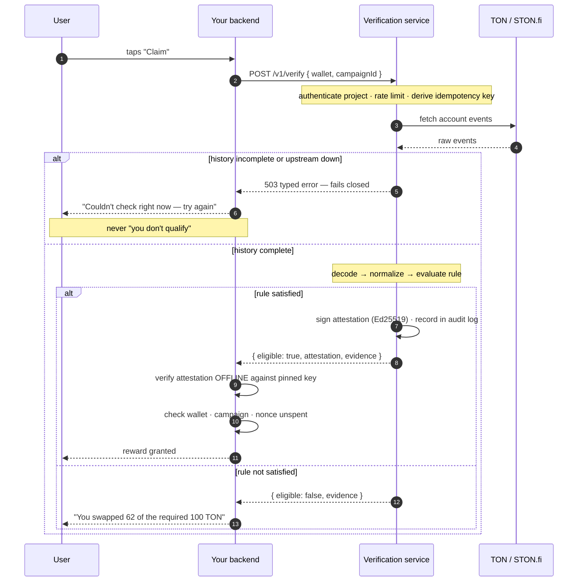
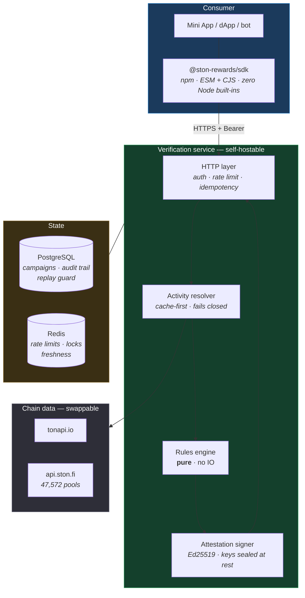
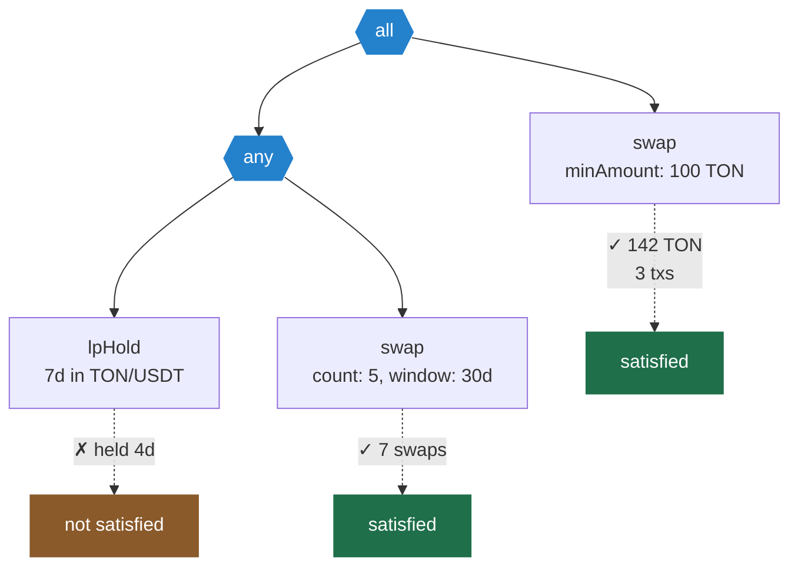
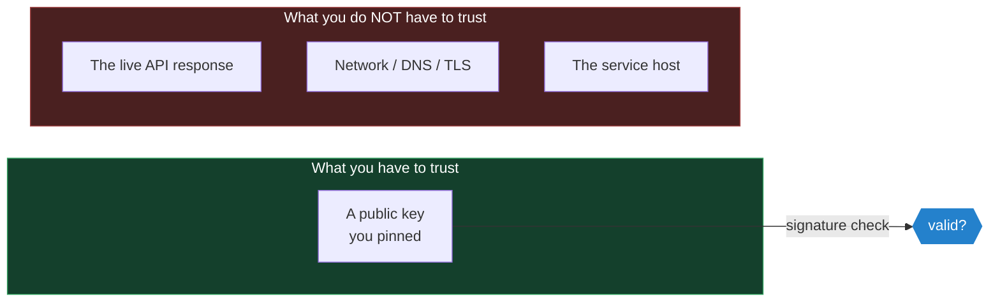
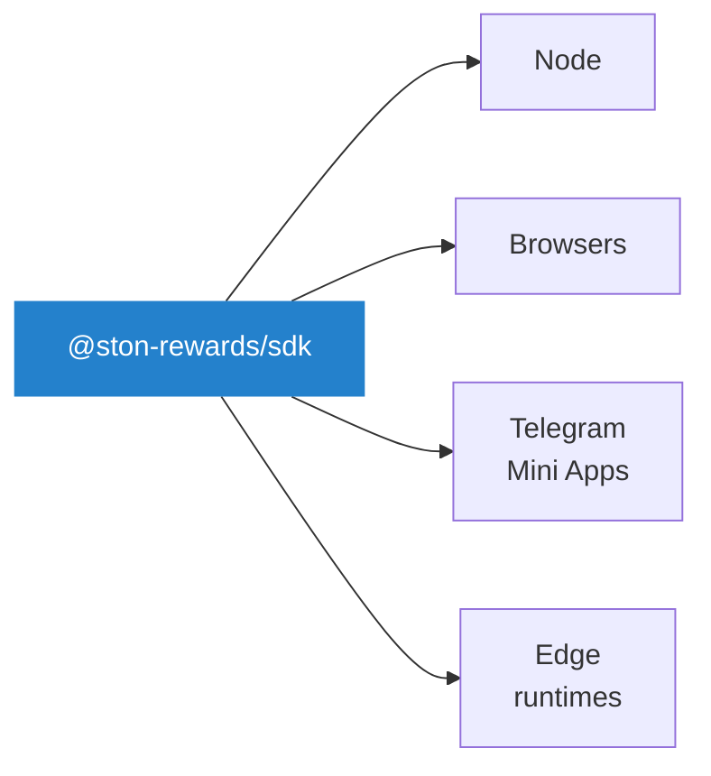
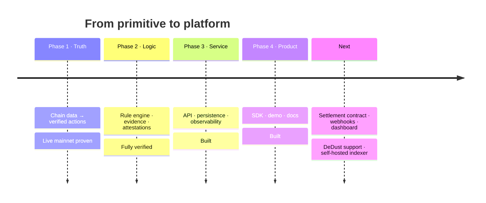

<div align="center">

# STON Rewards

**Programmable, verifiable reward rules over STON.fi activity.**

Define a rule in your own code. Ask whether a wallet satisfies it.
Get back a signed, offline-verifiable proof — and the evidence behind it.

[](#verification--status)
[](#license)
[](docs/security.md)
[](#the-sdk)

[Quickstart](docs/quickstart.md) · [Rule cookbook](docs/rules.md) · [Anti-abuse](docs/anti-abuse.md) · [Attestation spec](docs/attestation-spec.md) · [Self-hosting](docs/self-hosting.md) · [Threat model](docs/security.md)

</div>

---

## The problem

A TON Mini App wants to reward users for real STON.fi activity — *"swap 100 TON
and get in-game points"*, *"provide liquidity for a week and unlock a perk"*.

Today every team builds the same pipeline from scratch:

```
fetch transactions → decode STON.fi contract messages → match campaign logic
→ guard against replays and fake volume → store eligibility → hope it's right
```

That is one to three weeks of work per app, and **every implementation is
subtly wrong in the same ways**: native TON has three different on-chain
spellings, swaps report at router level so pools are ambiguous, LP tokens are
transferred rather than minted, and gross volume is trivially inflated by
swapping back and forth.

Quest platforms solve the *campaign website* version of this. Nothing solves the
**embedded developer primitive** version — rules defined in your own code,
verified server-side, consumed programmatically.

## What this is



> **No custody. No smart contract. No token.**
> The service proves *what happened on-chain* and signs that statement.
> Your app decides what the reward is and pays it from its own wallet.

---

## How it works

### The verification flow



The step that matters most is **8**: your app verifies the signature itself,
against a key it pinned. A spoofed response, hijacked DNS, or even a
compromised verification service cannot mint rewards from your treasury.

### Architecture



`rules` and `attest` are **pure** — they cannot import the IO packages, call
`fetch`, or read a clock. A test enforces it. That is what makes every
eligibility answer reproducible offline, years later, from `(rule, activity)`
alone.

---

## Quick start

```bash
npm install @ston-rewards/sdk
```

```ts
import { StonRewards, swap, all, lpHold, verifyAttestation } from "@ston-rewards/sdk";

const ston = new StonRewards({ apiKey: process.env.API_KEY!, baseUrl });

// 1 — Define a rule. Plain JSON under the hood; store it, send it, hash it.
const campaign = await ston.createCampaign({
  name: "Swap 100 TON and hold LP for a week",
  rule: all(
    swap({ minAmount: 100_000_000_000n, token: "TON" }),
    lpHold({ pool: TON_USDT, minDuration: "7d" }),
  ),
  startsAt: new Date(),
  endsAt: new Date(Date.now() + 30 * 86_400_000),
});

// 2 — Ask, from your backend, when the user claims.
const result = await ston.verify({ wallet, campaignId: campaign.id });

if (!result.eligible) {
  return render(result.evidence);   // ← show this, it explains the shortfall
}

// 3 — Verify offline against a key you pinned, then reward.
const check = await verifyAttestation(result.attestation!, PINNED_PUBLIC_KEY);
if (!check.valid) return;

const { wallet: proven, campaign: provenCampaign, nonce } = result.attestation!.payload;
if (proven !== wallet || provenCampaign !== campaign.id) return;
if (await nonceSpent(nonce)) return;

await markNonceSpent(nonce);        // before paying, never after
await awardPoints(userId, 100);
```

<details>
<summary><b>Why those last four checks are not optional</b></summary>

An attestation is a **bearer artifact** — valid until it expires, for whoever
holds it. The service cannot enforce single use, because only your app knows
whether it already paid.

| Check | Attack it prevents |
|---|---|
| `check.valid` | A forged or spoofed API response |
| `proven === wallet` | A real proof about *somebody else's* wallet |
| `provenCampaign === campaign.id` | A proof earned under a cheap campaign, redeemed against an expensive one |
| `nonce` unspent | Replaying one proof to be paid repeatedly — **the most common way integrations get drained** |

Record the nonce *before* paying: a crash between the two otherwise means a
double payout.
</details>

---

## The rule DSL

```
Rule       := Condition | Combinator
Combinator := { all: Rule[] } | { any: Rule[] }     ← max depth 3
Condition  := swap | lpAdd | lpHold
```



### Conditions

| Condition | Fields |
|---|---|
| **`swap`** | `minAmount` · `minVolumeUsd` · `token` · `pool` · `count` · `window` · `netVolume` *(default on)* |
| **`lpAdd`** | `minLpAmount` · `minAmountUsd` · `pool` · `count` · `window` |
| **`lpHold`** | `minDuration` *(required)* · `minLpAmount` · `pool` |

```ts
swap({ minAmount: 100_000_000_000n, token: "TON" })   // swapped 100 TON
swap({ count: 5, window: "30d" })                     // 5 swaps this month
lpHold({ pool: TON_USDT, minDuration: "7d" })         // held LP a week
any(swap({ count: 5 }), lpAdd({ minLpAmount: 1_000n })) // either path
```

Thresholds are in **token units** — on-chain truth, deterministic and
dispute-free. USD is available but is honestly labelled marketing-grade; see
[the caveat](docs/rules.md#token-units-versus-usd).

### Evidence — the trust feature

Every evaluation returns evidence, **on failure as well as success**:

```json
{
  "kind": "swap",
  "satisfied": false,
  "detail": "counted 62400000 of 100000000 token units",
  "measured": {
    "qualifyingSwaps": 3,
    "volumeTokenUnits": "62400000",
    "grossVolumeTokenUnits": "184000000",
    "netVolume": 1
  },
  "txHashes": ["ae72f139…", "0a708b7d…", "af015ab6…"]
}
```

Showing `gross` beside `net` is what makes *"but I swapped way more than that"*
answerable in a single screenshot. Evidence is byte-identical for identical
inputs and its hash is bound into the attestation, so a disputed result can be
re-derived offline and checked against the signature.

---

## Anti-abuse

Layered, configurable, and honest about its limits.

| Attack | Defence | Default |
|---|---|---|
| **Wash trading** | Net volume: `\|bought − sold\|` per asset. A round trip nets to ~0 | **on** |
| **Double-counted events** | One on-chain event counts once, ever — dedup at decode + DB uniqueness | **on** |
| **Replayed proofs** | `nonce` + 1h expiry *(app records spent nonces)* | **on** |
| **Double-tapped claims** | Server-derived idempotency + single-flight | **on** |
| **Rapid-fire farming** | `minInterval: "1h"` — applied *before* aggregation | opt-in |
| **Whales draining budget** | `maxRewardableVolumePerWallet` | opt-in |
| **Disposable wallets** | `minWalletAge: "30d"` | opt-in |
| **Multi-wallet Sybil rings** | ⚠️ **Not solved.** Bind rewards to a Telegram user id | — |

The Sybil gap is stated plainly rather than buried. One reward per Telegram
identity makes a ring cost one Telegram account per extra claim — which raises
the price substantially without pretending to a solution.
[Full guide →](docs/anti-abuse.md)

---

## Attestations

```json
{
  "payload": {
    "v": 1, "project": "prj_abc", "campaign": "cmp_xyz",
    "wallet": "0:83d6…fa03", "rule_hash": "sha256:…",
    "eligible": true, "evidence_hash": "sha256:…",
    "issued_at": 1800000000, "expires_at": 1800003600, "nonce": "5f3a…"
  },
  "signature": "<128 hex chars>"
}
```

**Ed25519** over **RFC 8785 canonical JSON**. Both are specified in ways any
language can implement — the [spec](docs/attestation-spec.md) includes Python
and Go verifiers in four lines each.



*A signed negative is never issued* — it would be a durable, transferable
statement about someone's wallet with no upside. Failures return evidence.

---

## The SDK



| Property | Detail |
|---|---|
| Packaging | Dual **ESM + CJS**, full `.d.ts`, tree-shakeable |
| Node built-ins | **Zero** — enforced by a test, not convention |
| External deps | None of its own; two audited crypto libraries transitively |
| Offline verify | Pure function, no network, no Node APIs |
| Errors | Typed, with an explicit `retryable` flag |

---

## Repository layout

```
packages/
  core-types/     shared types · address handling · error taxonomy
  data-provider/  tonapi client · pool registry · retry        ← all IO
  decoder/        raw events → normalized actions              ← pure
  activity/       resolver + USD rates · fails closed
  rules/          DSL · validation · evaluation · evidence      ← pure
  attest/         canonical JSON · Ed25519 sign/verify          ← pure
  service/        Fastify API · persistence · auth · metrics
  sdk/            public npm client                             ← portable
apps/
  cli/            `pnpm decode <wallet>` — inspect real activity
  demo-miniapp/   Telegram Mini App with an evidence panel
  examples/       jetton-payout reference integration
docs/             quickstart · rules · anti-abuse · spec · self-hosting · security
```

---

## Self-hosting

```bash
git clone <repo> && cd ston-rewards
cp .env.example .env
echo "MASTER_KEY=$(openssl rand -hex 32)" >> .env

docker compose up --build -d
docker compose run --rm api pnpm --filter @ston-rewards/service migrate
docker compose run --rm api pnpm --filter @ston-rewards/service provision "My App"
```

Open source and self-hostable **first-class**. Serious teams should not gate
reward eligibility on someone else's uptime — and offline-verifiable
attestations mean they do not have to. [Guide →](docs/self-hosting.md)

### Operational guarantees

| Guarantee | How |
|---|---|
| **Fails closed** | Incomplete history → `503`, never a confident wrong answer |
| **One attestation per claim** | Server-derived idempotency key |
| **One fetch per wallet** | Single-flight — *tested at 100 concurrent → 1 fetch* |
| **Keys never stored in clear** | AES-256-GCM under an env-held master key |
| **Every issuance audited** | Recorded before it is returned |
| **Early warning** | `ston_unknown_actions_total` rises when STON.fi ships a contract change |

---

## Verification & status

**360 tests · 19 suites · 0 known vulnerabilities · typecheck clean**

| Phase | What it delivers | Status |
|---|---|---|
| **1 — Truth layer** | Chain data → normalized STON.fi actions | ✅ **verified against live mainnet** |
| **2 — Logic layer** | Rules, evidence, signed attestations | ✅ **fully verified** |
| **3 — Service layer** | API, persistence, auth, observability | 🟡 logic verified; DB/Redis adapters pending live run |
| **4 — Product layer** | SDK, demo, docs, security pass | 🟡 SDK verified; demo pending live service |

### Proven against real chain data

```
$ pnpm decode 0:83d606…fa03 --days 400 --usd

LP_ADD     lp=220021  pool=0:fc4c…9d7e
LP_REMOVE  lp=220021  pool=0:fc4c…9d7e  7642096705 TON + 10056067 USDT  ~$7686.43
position:  opened 07:22:59 → closed 07:25:02

2 actions, 0 undecodable (0.0%)
```

| Measured | Result |
|---|---|
| Swap decoding on a live wallet | **20/20 actions, 0% undecodable** |
| Pool attribution | **19/20**; the 20th correctly refused as ambiguous |
| Router-scoped pair ambiguity, full registry | **0.28%** of 47,572 pools |
| Concurrent claims → upstream fetches | **100 → 1** |
| Cross-language signature check | Verified with Node `crypto`, independent of the signing library |

### Known limitations — stated, not hidden

| # | Limitation | Impact |
|---|---|---|
| G6 | Fixture set at 5; the bar is 30+ | Missing v2 routers, multi-hop, partial LP withdrawal |
| G7 | USD uses current rate, not historical | USD rules are marketing-grade; token units are dispute-proof |
| G8 | ~0.3% of swaps unattributable to a pool | Pool-scoped rules will not match them — deliberate refusal over guessing |
| G9 | LP token legs are best-effort | Pool, LP units and timing are authoritative; legs are evidence only |

Full detail in [`../project/gap.md`](../project/gap.md).

---

## Design decisions worth knowing

<details>
<summary><b>Why refuse rather than guess?</b></summary>

Chain data reports swaps at router level, so a pool must be inferred from the
token pair. When several pools share a pair, the swap is recorded **without** a
pool rather than attributed to a likely one.

A false negative is a support ticket. A **false positive is a payout you cannot
claw back**. Every ambiguous case in this system resolves toward the former.
</details>

<details>
<summary><b>Why is the rules engine forbidden from doing IO?</b></summary>

Because a disputed eligibility answer has to be re-derivable. Evaluation takes
an `ActivitySet` and never fetches, never reads a clock, never imports the IO
packages — a CI test enforces all three. The same `(rule, activity)` pair
therefore always produces byte-identical evidence.
</details>

<details>
<summary><b>Why is net volume the default?</b></summary>

Gross volume is inflated by swapping back and forth at near-zero cost. Netting
per asset makes a round trip worth roughly nothing, while a genuine one-way
position still counts in full. Both figures appear in evidence so the user can
see why.
</details>

<details>
<summary><b>Why no signed "not eligible"?</b></summary>

It would be a durable, transferable statement about a person's wallet with no
upside — and the caller already has the evidence explaining the failure.
</details>

<details>
<summary><b>Three findings that only real chain data revealed</b></summary>

Each would have been a silent under-count in production:

1. **Native TON has three spellings** — pTON master on-chain, zero address in
   the pool list, a sentinel here. Compared literally, *every* TON swap failed
   to match its own pool.
2. **LP tokens are transferred, not minted.** A mint-only decoder sees every
   STON.fi deposit as nothing.
3. **Native legs live in `ton_in`/`ton_out`**, with the jetton amount field left
   empty — reading only the jetton field drops most swaps on the DEX.
</details>

---

## Roadmap



**Beyond v1:** an optional on-chain settlement contract, webhook push with a
duration-rule scheduler, a dashboard, a self-hosted indexer, and multi-DEX
support — each earned one primitive at a time.

---

## License

MIT. Open source, self-hostable, and specified so that nothing here is a
dependency you cannot replace.
