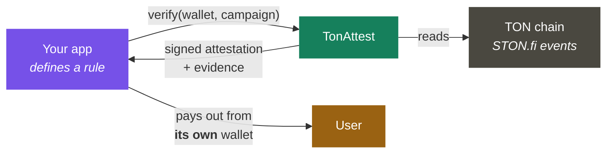
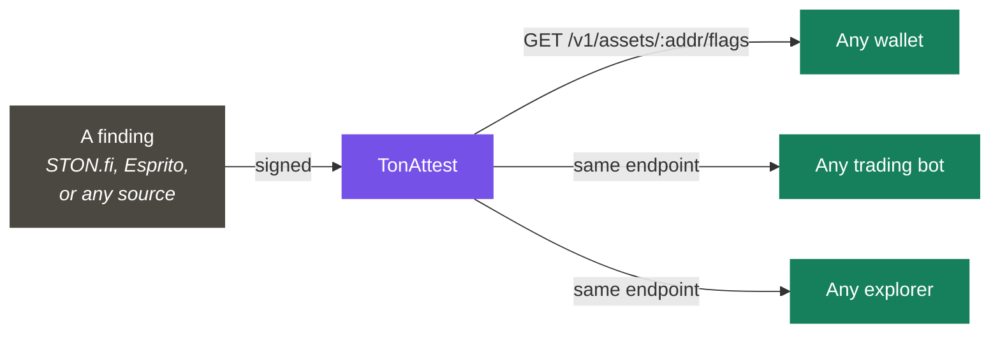
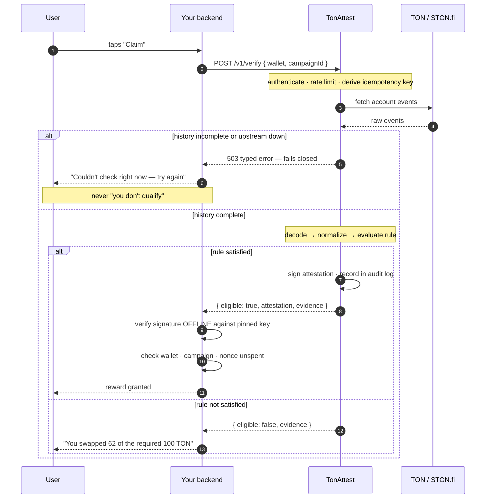
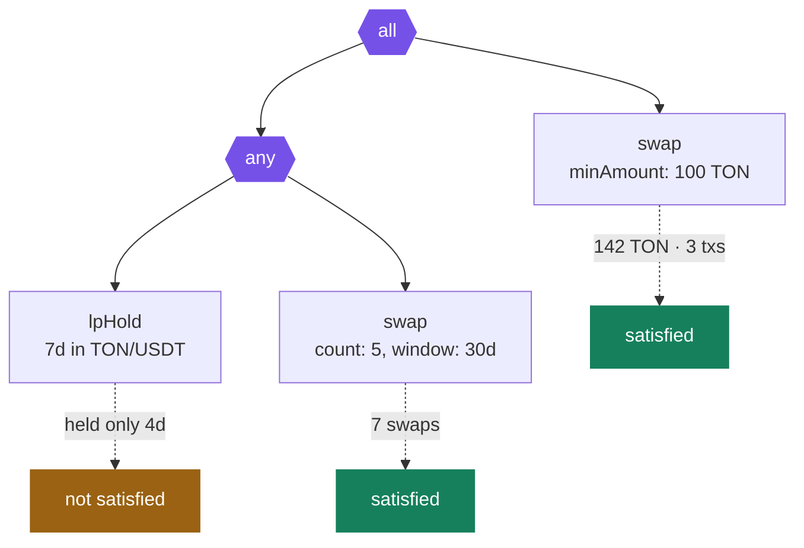
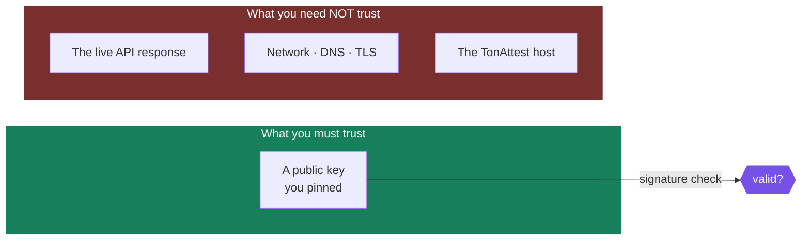
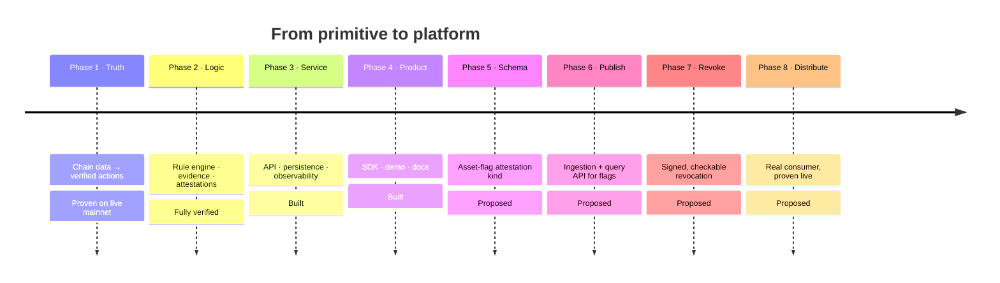

<div align="center">


# TonAttest

### Don't trust the claim. Verify it.

**A signed, offline-verifiable attestation layer for TON.**
Take any fact about the chain — a wallet satisfied a reward rule, an asset was
flagged as malicious — and turn it into a proof anyone can check themselves,
without trusting a live server.

[](#evidence-it-works)
[](tonattest/docs/security.md)
[](#license)
[](#the-sdk)

```bash
npm install @tonattest/sdk
```

[**Quickstart**](tonattest/docs/quickstart.md) · [Rule cookbook](tonattest/docs/rules.md) · [Anti-abuse](tonattest/docs/anti-abuse.md) · [Attestation spec](tonattest/docs/attestation-spec.md) · [Self-hosting](tonattest/docs/self-hosting.md) · [Threat model](tonattest/docs/security.md)

</div>

## Two things, one primitive

TonAttest signs facts about the TON chain so anyone can verify them offline,
without trusting a live server. Everything else in this repo is one of two
applications of that single mechanism.

| | **Reward verification** | **Asset trust layer** |
|---|---|---|
| The fact signed | *"wallet X satisfied rule Y"* | *"asset X was flagged Z, by source W"* |
| Who asks | Your app, checking a claim | Any wallet, bot, or explorer |
| Status | ✅ **Built.** 360 tests, verified on live mainnet | 🟡 **Proposed.** Requested by STON.fi — [full write-up](project/grant-reapplication-trust-layer.md) |
| Try it | `npm install @tonattest/sdk` | [Phase 5–8 build plan](#application-2--asset-trust-layer-proposed) |

Same signer. Same canonical JSON. Same `verifyAttestation()` running entirely
offline. The only thing that changes between the two is **what fact is being
attested** — a reward rule today, an asset's trust status next.

---

## The problem

A TON Mini App wants to reward real STON.fi activity — *"swap 100 TON and earn
points"*, *"provide liquidity for a week and unlock a perk"*.

Today every team builds the same pipeline from scratch:

```
fetch transactions → decode contract messages → match campaign logic
→ guard against replays → detect fake volume → store eligibility
```

That is one to three weeks per app, and **each implementation is subtly wrong
in the same places.** These are not hypotheticals — every one was found by
running a decoder against live mainnet data:

| The trap | What it does if you miss it |
|---|---|
| Native TON has three on-chain spellings | Compared literally, *every* TON swap fails to match its own pool |
| LP tokens are transferred, not minted | A mint-only decoder sees every liquidity deposit as nothing |
| Native amounts live in a separate field | Reading only the jetton field silently drops most swaps on the DEX |
| Gross volume is free to inflate | Swapping back and forth manufactures unlimited qualifying volume |

Quest platforms solve the *campaign website* version of this. TonAttest is the
**embedded developer primitive** — rules defined in your own code, verified
server-side, consumed programmatically.

## What TonAttest is

The same mechanism either application runs on: TonAttest reads a fact, signs it, and hands back a proof your app checks itself.



> **No custody. No smart contract. No token.**
> TonAttest proves *what happened on-chain* and signs that statement.
> Your app decides what the reward is and pays it from its own wallet.

---

## Application 2 — Asset trust layer `proposed`

**Not yet built — this is the plan, not a claim.** Raised directly by STON.fi
on a grant discovery call: could the same attestation mechanism that verifies
reward claims also make token-safety data — honeypots, scams, blacklists —
readable by every wallet and bot in the ecosystem, not just STON.fi's own UI?
Full write-up: [project/grant-reapplication-trust-layer.md](project/grant-reapplication-trust-layer.md).

Right now STON.fi flags malicious tokens — honeypots, scams, blacklisted
contracts — but that data lives **only in STON.fi's own UI.** No wallet,
trading bot, or explorer in the TON ecosystem can read it. Each one either
builds its own detection or has none.

That's not a detection problem — good detection already exists. **Esprito
Protocol's TSA** ([github.com/espritoxyz/tsa](https://github.com/espritoxyz/tsa))
does genuinely sophisticated static analysis: it reads compiled contract
bytecode and uses *symbolic execution* — exploring every possible code path
with placeholder values — to catch honeypot patterns and TVM-level bugs. It's
open source and it works. **What's missing is a portable, verifiable way to
publish and consume a finding, from any source, across the ecosystem.**

That's a distribution problem, and distribution is exactly what an
attestation is for.



### The same primitive, a second fact shape

The signer, the canonicalization, and offline verification are **already
built and already proven** — this reuses them without modification. Only the
*subject* of the attestation changes:

```json
{
  "v": 1,
  "subject": "asset",
  "address": "0:8cdc1d76…",
  "flag": "honeypot",
  "severity": "high",
  "source": "stonfi",
  "issued_at": 1755300000,
  "revoked_at": null
}
```

Same Ed25519 signature. Same `verifyAttestation()`. Same "check it yourself,
offline, no live trust required" guarantee that already exists for campaigns
— just pointed at a different kind of fact.

### What it makes possible

| Consumer | What they get, without building anything themselves |
|---|---|
| A wallet (Tonkeeper, MyTonWallet, …) | A warning before a user swaps into a flagged token |
| A trading bot | An automatic refusal to route through a flagged asset |
| STON.fi | Its existing flags become portable and citable, correctly attributed, instead of trapped in one UI |
| Esprito (or any detector) | Findings become distributable without duplicating anyone's detection engine |

**What this is not:** a second honeypot detector. Esprito already built that
— symbolic execution over TVM bytecode is a real specialty, and rebuilding it
would be wasted effort and a needless collision with an existing STON.fi
partner. This is the layer that makes *any* detector's output portable.

### Phase 5–8 — the build plan

| Phase | Delivers | Builds on |
|---|---|---|
| **5 — Attestation schema extension** | A second attestation kind (`subject: "asset"`), signed and verified the same way | `@tonattest/attest`, `@tonattest/rules` — additive, no rework |
| **6 — Ingestion + publishing API** | Submit a flag (source-attributed) · query current flags for an asset | `@tonattest/service` — same auth, rate-limiting, audit trail already built |
| **7 — Revocation lifecycle** | A revocation is itself signed and checkable — not silent deletion | Existing attestation audit log, extended |
| **8 — Distribution & pilot** | A real consumer checking a real flag, offline — proven the way Phase 1 was proven on live mainnet | New — the end-to-end proof phase |

Each phase ends in something independently useful, the same discipline the
original four phases followed.

---

## Application 1 — Reward verification `built`

Define a rule in your own code. Ask whether a wallet satisfies it. Get back a
signed, offline-verifiable proof — and the evidence behind the answer. This
is the product below, in full: proven, tested, and live-mainnet-verified.

## How it works



**Step 9 is the one that matters.** Your app checks the signature itself,
against a public key it pinned at deploy time. A spoofed response, a hijacked
DNS record, or a fully compromised TonAttest instance cannot mint rewards from
your treasury — which is also why hosted and self-hosted have the same security
story.

### Failure is never a wrong answer

If a wallet's history cannot be resolved completely — upstream outage, rate
limit, or a history larger than the fetch cap — TonAttest returns a typed `503`
rather than evaluating partial data. An under-counted history produces a
confident *"you don't qualify"* for someone who did.

> A false negative is a support ticket. A **false positive is a payout you
> cannot claw back.** Every ambiguous case in this system resolves toward the
> former.

---

## Quick start

```bash
npm install @tonattest/sdk
```

```ts
import { TonAttest, swap, all, lpHold, verifyAttestation } from "@tonattest/sdk";

const attest = new TonAttest({ apiKey: process.env.TONATTEST_API_KEY!, baseUrl });

// 1 — Define a rule. Plain JSON underneath: store it, send it, hash it.
const campaign = await attest.createCampaign({
  name: "Swap 100 TON and hold LP for a week",
  rule: all(
    swap({ minAmount: 100_000_000_000n, token: "TON" }),
    lpHold({ pool: TON_USDT, minDuration: "7d" }),
  ),
  startsAt: new Date(),
  endsAt: new Date(Date.now() + 30 * 86_400_000),
});

// 2 — Ask, from your backend, when the user claims.
const result = await attest.verify({ wallet, campaignId: campaign.id });

if (!result.eligible) {
  return render(result.evidence);   // ← show this; it explains the shortfall
}

// 3 — Verify offline against a key you pinned, then reward.
const check = await verifyAttestation(result.attestation!, PINNED_PUBLIC_KEY);
if (!check.valid) return;

const { wallet: proven, campaign: provenCampaign, nonce } = result.attestation!.payload;
if (proven !== wallet || provenCampaign !== campaign.id) return;
if (await nonceSpent(nonce)) return;

await markNonceSpent(nonce);        // before paying, never after
await awardPoints(userId, 100);
```

<details>
<summary><b>Why those four checks are not optional</b></summary>

<br>

An attestation is a **bearer artifact** — valid until it expires, for whoever
holds it. TonAttest cannot enforce single use, because only your app knows
whether it already paid.

| Check | Attack it prevents |
|---|---|
| `check.valid` | A forged or spoofed API response |
| `proven === wallet` | A real proof about *somebody else's* wallet |
| `provenCampaign === campaign.id` | A proof earned under a cheap campaign, redeemed against an expensive one |
| `nonce` unspent | Replaying one proof to be paid repeatedly — **the most common way integrations get drained** |

Record the nonce *before* paying: a crash between the two otherwise means a
double payout.

</details>

---

## The rule language

```
Rule       := Condition | Combinator
Combinator := { all: Rule[] } | { any: Rule[] }     ← max depth 3
Condition  := swap | lpAdd | lpHold
```

| Condition | Fields |
|---|---|
| **`swap`** | `minAmount` · `minVolumeUsd` · `token` · `pool` · `count` · `window` · `netVolume` *(default on)* |
| **`lpAdd`** | `minLpAmount` · `minAmountUsd` · `pool` · `count` · `window` |
| **`lpHold`** | `minDuration` *(required)* · `minLpAmount` · `pool` |

```ts
swap({ minAmount: 100_000_000_000n, token: "TON" })     // swapped 100 TON
swap({ count: 5, window: "30d" })                       // 5 swaps this month
lpHold({ pool: TON_USDT, minDuration: "7d" })           // held LP a week
any(swap({ count: 5 }), lpAdd({ minLpAmount: 1_000n })) // either path qualifies
```



Thresholds are in **token units** — on-chain truth, deterministic and
dispute-free. USD is available but honestly labelled marketing-grade;
[see the caveat](tonattest/docs/rules.md#token-units-versus-usd).

### Evidence is the trust feature

Every evaluation returns evidence, **on failure as well as success**:

```json
{
  "kind": "swap",
  "satisfied": false,
  "detail": "counted 62400000 of 100000000 token units",
  "measured": {
    "qualifyingSwaps": 3,
    "volumeTokenUnits": "62400000",
    "grossVolumeTokenUnits": "184000000",
    "netVolume": 1
  },
  "txHashes": ["ae72f139…", "0a708b7d…", "af015ab6…"]
}
```

Showing `gross` beside `net` is what makes *"but I swapped way more than that"*
answerable in a single screenshot. Evidence is byte-identical for identical
inputs and its hash is bound into the attestation, so a disputed result can be
re-derived offline and checked against the signature.

---

## Anti-abuse

| Attack | Defence | Default |
|---|---|---|
| **Wash trading** | Net volume: `\|bought − sold\|` per asset. A round trip nets to ~0 | **on** |
| **Double-counted events** | One on-chain event counts once, ever — dedup at decode + DB constraint | **on** |
| **Replayed proofs** | Single-use `nonce` + 1h expiry *(app records spent nonces)* | **on** |
| **Double-tapped claims** | Server-derived idempotency + single-flight | **on** |
| **Rapid-fire farming** | `minInterval: "1h"` — applied *before* aggregation | opt-in |
| **Whales draining a budget** | `maxRewardableVolumePerWallet` | opt-in |
| **Disposable wallets** | `minWalletAge: "30d"` | opt-in |
| **Multi-wallet Sybil rings** | ⚠️ **Not solved.** Bind rewards to a Telegram identity | — |

The Sybil gap is stated plainly rather than buried. One reward per Telegram
user id makes a ring cost one Telegram account per extra claim — which raises
the price substantially without pretending to a solution.
[Full guide →](tonattest/docs/anti-abuse.md)

---

## Attestations

```json
{
  "payload": {
    "v": 1, "project": "prj_abc", "campaign": "cmp_xyz",
    "wallet": "0:83d6…fa03", "rule_hash": "sha256:…",
    "eligible": true, "evidence_hash": "sha256:…",
    "issued_at": 1800000000, "expires_at": 1800003600, "nonce": "5f3a…"
  },
  "signature": "<128 hex chars>"
}
```

**Ed25519** over **RFC 8785 canonical JSON** — both specified so any language
can verify. The [spec](tonattest/docs/attestation-spec.md) includes Python and
Go verifiers in four lines each.



*A signed negative is never issued* — it would be a durable, transferable
statement about someone's wallet with no upside. Failures return evidence.

---

## The SDK

| Property | Detail |
|---|---|
| Package | **`@tonattest/sdk`** |
| Packaging | Dual **ESM + CJS**, full `.d.ts`, tree-shakeable |
| Node built-ins | **Zero** — enforced by a test, not convention |
| External deps | None of its own; two audited crypto libraries transitively |
| Offline verify | Pure function — no network, no Node APIs |
| Errors | Typed, with an explicit `retryable` flag |

Runs unchanged in Node, browsers, Telegram Mini Apps, and edge runtimes.

---

## Repository layout

```
tonattest/
  packages/
    core-types/     shared types · address handling · error taxonomy
    data-provider/  tonapi client · pool registry · retry        ← all IO
    decoder/        raw events → normalized actions              ← pure
    activity/       resolver + USD rates · fails closed
    rules/          DSL · validation · evaluation · evidence      ← pure
    attest/         canonical JSON · Ed25519 sign/verify          ← pure
    service/        Fastify API · persistence · auth · metrics
    sdk/            @tonattest/sdk — the public client            ← portable
  apps/
    cli/            `pnpm decode <wallet>` — inspect real activity
    demo-miniapp/   Telegram Mini App with an evidence panel
    examples/       jetton-payout reference integration
  docs/             quickstart · rules · anti-abuse · spec · self-hosting · security

index.html          landing site
how-it-works.html   illustrated walkthrough
```

`rules` and `attest` are **pure** — they cannot import the IO packages, call
`fetch`, or read a clock. A test enforces it. That is what makes every
eligibility answer reproducible offline, years later, from `(rule, activity)`
alone.

---

## Self-hosting

```bash
git clone https://github.com/Tuhin810/TonAttest.git && cd tonattest
cp .env.example .env
echo "MASTER_KEY=$(openssl rand -hex 32)" >> .env

docker compose up --build -d
docker compose run --rm api pnpm --filter @tonattest/service migrate
docker compose run --rm api pnpm --filter @tonattest/service provision "My App"
```

Open source and self-hostable **first-class**. Serious teams should not gate
reward eligibility on someone else's uptime — and offline-verifiable
attestations mean they do not have to.
[Guide →](tonattest/docs/self-hosting.md)

### Operational guarantees

| Guarantee | How |
|---|---|
| **Fails closed** | Incomplete history → `503`, never a confident wrong answer |
| **One attestation per claim** | Server-derived idempotency key |
| **One fetch per wallet** | Single-flight — *tested at 100 concurrent → 1 fetch* |
| **Keys never stored in clear** | AES-256-GCM under an env-held master key |
| **Every issuance audited** | Recorded before it is returned |
| **Early warning** | `tonattest_unknown_actions_total` rises when STON.fi ships a contract change |

---

## Evidence it works

**360 tests · 19 suites · 0 known vulnerabilities · typecheck clean**

A real liquidity round trip, decoded from mainnet by the CLI in this repo:

```
$ pnpm decode 0:83d606…fa03 --days 400 --usd

LP_ADD     lp=220021  pool=0:fc4c…9d7e
LP_REMOVE  lp=220021  pool=0:fc4c…9d7e  7642096705 TON + 10056067 USDT  ~$7686.43
position:  opened 07:22:59 → closed 07:25:02

2 actions, 0 undecodable (0.0%)
```

| What was measured | Result |
|---|---|
| Swap decoding across a live wallet's history | **20/20 actions, 0% undecodable** |
| Pool attribution on those swaps | **19/20**; the 20th correctly refused |
| Router-scoped pair ambiguity, full registry | **0.28%** of 47,572 pools |
| Concurrent verifications → upstream fetches | **100 → 1** |
| Signature checked by an independent implementation | Node `crypto`, not the signing library |
| Evidence determinism across repeated runs | Byte-identical, 50 iterations |

### Delivery status

| Phase | Delivers | Status |
|---|---|---|
| **1 — Truth layer** | Chain data → normalized STON.fi actions | ✅ verified on live mainnet |
| **2 — Logic layer** | Rules, evidence, signed attestations | ✅ fully verified |
| **3 — Service layer** | API, persistence, auth, observability | 🟡 logic verified; DB/Redis adapters pending a live run |
| **4 — Product layer** | SDK, demo, docs, security pass | 🟡 SDK verified; demo pending a live service |

### Known limitations — stated, not hidden

| Limitation | Consequence |
|---|---|
| Fixture set below target | Missing v2 routers, multi-hop routes, partial LP withdrawal |
| USD uses the current rate, not the historical one | USD rules are marketing-grade; token units are dispute-proof |
| ~0.3% of swaps unattributable to a pool | Pool-scoped rules will not match them — deliberate refusal over guessing |
| LP token legs are best-effort | Pool, LP units and timing are authoritative; legs are evidence only |

Full detail in [`project/gap.md`](project/gap.md).

---

## Design decisions worth interrogating

<details>
<summary><b>Why refuse rather than guess?</b></summary>

<br>

Chain data reports swaps at router level, so a pool must be inferred from the
token pair. When several pools share a pair, the swap is recorded **without** a
pool rather than attributed to a likely one. A false negative is a support
ticket; a false positive is a payout that cannot be clawed back.

</details>

<details>
<summary><b>Why is the rules engine forbidden from doing IO?</b></summary>

<br>

Because a disputed eligibility answer has to be re-derivable. Evaluation takes
an `ActivitySet` and never fetches, never reads a clock, never imports the IO
packages — a CI test enforces all three. The same `(rule, activity)` pair
therefore always produces byte-identical evidence.

</details>

<details>
<summary><b>Why is net volume the default?</b></summary>

<br>

Gross volume is inflated by swapping back and forth at near-zero cost. Netting
per asset makes a round trip worth roughly nothing, while a genuine one-way
position still counts in full. Both figures appear in evidence.

</details>

<details>
<summary><b>Why no smart contract or custody in v1?</b></summary>

<br>

Settlement is the integrating app's job. Keeping funds entirely out of the
system means a compromise of TonAttest cannot move anyone's money, and it
removes the audit surface that would otherwise dominate the build. An on-chain
settlement contract is a later, optional layer — not a prerequisite for the
primitive to be useful.

</details>

<details>
<summary><b>Three findings that only real chain data revealed</b></summary>

<br>

Each would have been a silent under-count in production:

1. **Native TON has three spellings** — pTON master on-chain, zero address in
   the pool list, a sentinel internally. Compared literally, *every* TON swap
   failed to match its own pool.
2. **LP tokens are transferred, not minted.** A mint-only decoder sees every
   STON.fi deposit as nothing.
3. **Native legs live in `ton_in`/`ton_out`**, with the jetton amount field left
   empty — reading only the jetton field drops most swaps on the DEX.

</details>

---

## Roadmap



Phases 1–4 are [reward verification](#application-1--reward-verification-built),
done. Phases 5–8 are the [asset trust layer](#application-2--asset-trust-layer-proposed)
— proposed, not yet built. Further out: DeDust and multi-DEX support, a
self-hosted indexer, and a dashboard — each earned once the layer above it is
proven, the same discipline that got phases 1–4 here.

---

## License

MIT. Open source, self-hostable, and specified so that nothing here is a
dependency you cannot replace.

<div align="center">
<br>
<sub><b>TonAttest</b> — proof-of-action infrastructure for TON</sub>
</div>
