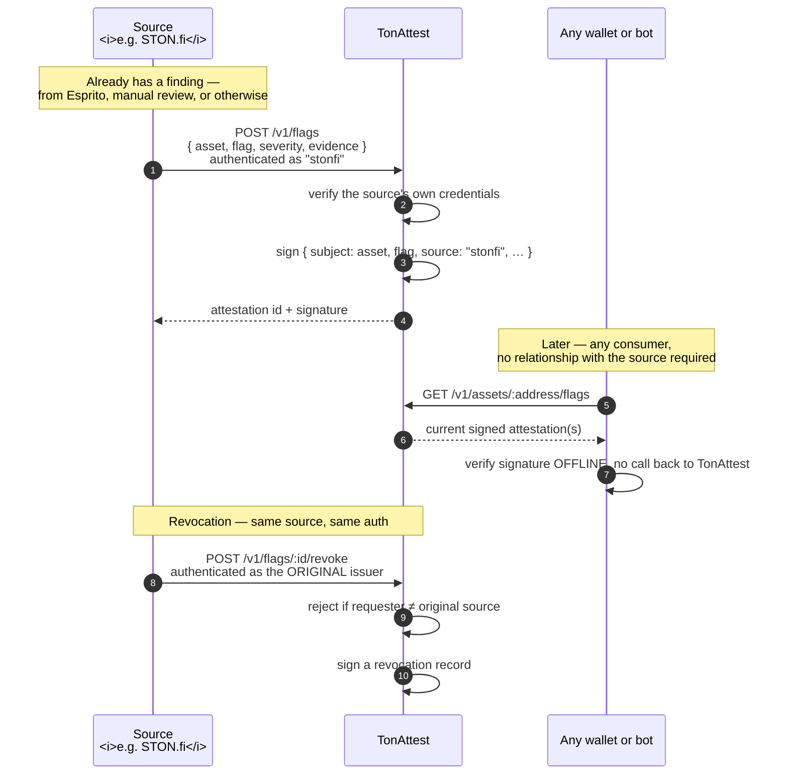

# Build Plan — Phases 5–8

The mechanism these phases build, concretely:

Submitting a flag requires authenticating as a real, named source — nobody
can flag an asset anonymously or on TonAttest's own authority. Revoking one
requires authenticating as that *same* source, enforced by the service
itself rather than left as a policy anyone has to trust.

Phased the same way the original delivery was — each phase ends in something independently useful, so partial completion still leaves value behind.

| Phase | Delivers | Builds on |
|---|---|---|
| **5 — Attestation schema extension** | A second attestation *kind* (`subject: "asset"`) alongside the existing campaign kind; canonicalization, signing, and offline verification extended and tested the same way the original was | `@tonattest/attest`, `@tonattest/rules` — no rework, additive types |
| **6 — Ingestion + publishing API** | Endpoints to submit a flag (authenticated, source-attributed) and to query current flags for an asset, including revocation history | `@tonattest/service` — same Fastify app, new routes, same auth/rate-limit/audit-trail machinery already built |
| **7 — Revocation lifecycle** | Formal revoke flow, authenticated to the original issuing source only; a revocation is itself signed and checkable, distinct from silent deletion | Existing `attestations` table + audit log |
| **8 — Distribution & pilot integration** | A reference integration (e.g., a lookup widget, or a direct pilot with a named wallet/bot) showing a real consumer checking a real flag, offline | New — the "prove it end to end" phase, mirroring how Phase 1 was proven against live mainnet data |

## Budget

| Item | Amount | Deliverable |
|---|---|---|
| Attestation schema + signing extension (Phase 5) | $1,200 | Tested, additive change to the existing pure `rules`/`attest` packages |
| Ingestion + publishing API (Phase 6) | $1,500 | New service endpoints, reusing existing auth/rate-limit/audit infrastructure |
| Revocation lifecycle (Phase 7) | $800 | Signed revocation flow, tested against the same concurrency/fail-closed standards as the existing service |
| Pilot integration + distribution (Phase 8) | $1,500 | A real, working consumer of a real flag — the "proof it works" moment for this phase, same bar as the mainnet decoder proof in the original build |

**Total: $5,000** — unchanged from the original ask; reallocated toward this extension rather than toward closing the original product's remaining documented gaps (fixture coverage, historical pricing), which remain lower-risk and can proceed in parallel at lower cost.

## Exit criteria, same discipline as Phases 1–4

Each phase below ends in something independently useful, the way the original build did: Phase 1 alone left a working decoder anyone could run against real mainnet data, even before the rules engine existed. The same discipline applies here — Phase 5 alone leaves a tested, additive schema change; Phase 8 alone leaves a real, proven consumer checking a real flag offline.

See [How It Works](how-it-works.md) for the mechanism these phases build, and [Liability & Pricing](liability-and-pricing.md) for the constraints — source-authenticated ingestion, source-only revocation — that Phases 6 and 7 must enforce, not just describe.
