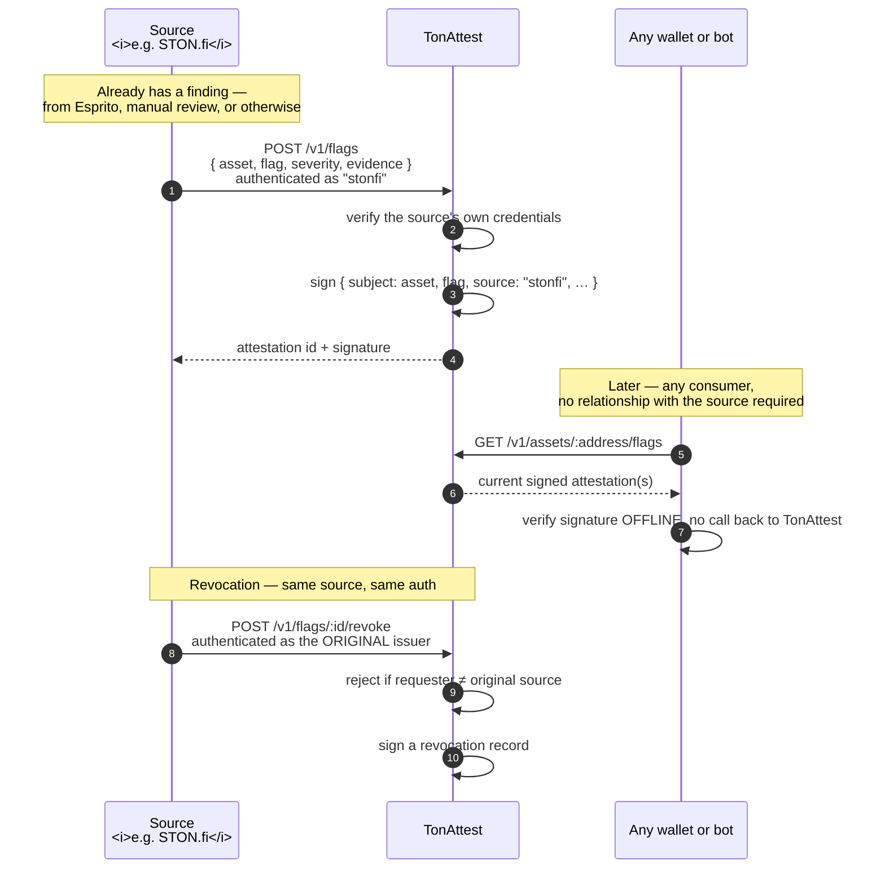

# How It Works

## The same primitive, a second fact shape

The signer, the canonicalization, and offline verification are **already
built and already proven** — this reuses them without modification. Only the
*subject* of the attestation changes:

```json
{
  "v": 1,
  "subject": "asset",
  "address": "0:8cdc1d76…",
  "flag": "honeypot",
  "severity": "high",
  "source": "stonfi",
  "issued_at": 1755300000,
  "revoked_at": null
}
```

Same Ed25519 signature. Same `verifyAttestation()`. Same "check it yourself,
offline, no live trust required" guarantee that already exists for campaigns
— just pointed at a different kind of fact.

## How a flag actually gets published



Two things this makes concrete rather than implied: **submitting a flag
requires being authenticated as a real, named source** — nobody can flag an
asset anonymously or on TonAttest's own authority — and **revoking one
requires being authenticated as that *same* source**, enforced by the
service, not left as a policy anyone has to trust.

## Next

* [Liability & Pricing](liability-and-pricing.md)
* [Build Plan](build-plan.md)
