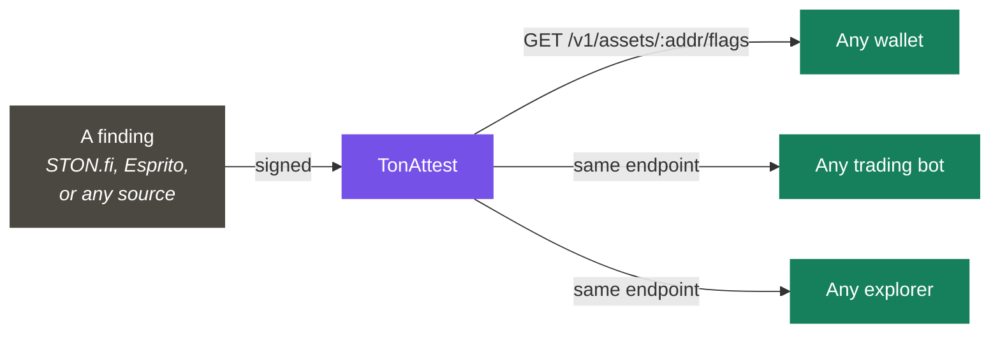
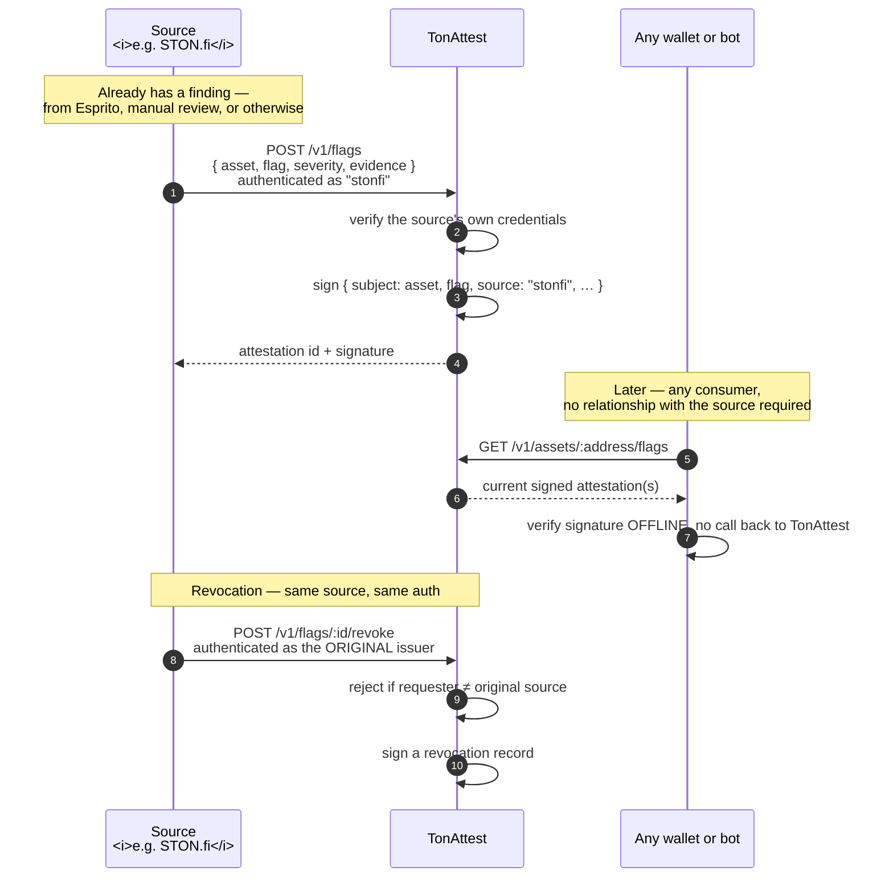

# Asset Trust Layer — Overview

**Status: proposed, not yet built.** Raised directly by STON.fi on a grant discovery call. See the [full reapplication](../reference/grant-reapplication.md) for the complete write-up submitted to the grant committee.

**Not yet built — this is the plan, not a claim.** Raised directly by STON.fi
on a grant discovery call: could the same attestation mechanism that verifies
reward claims also make token-safety data — honeypots, scams, blacklists —
readable by every wallet and bot in the ecosystem, not just STON.fi's own UI?
Full write-up: [project/grant-reapplication-trust-layer.md](project/grant-reapplication-trust-layer.md).

Right now STON.fi flags malicious tokens — honeypots, scams, blacklisted
contracts — but that data lives **only in STON.fi's own UI.** No wallet,
trading bot, or explorer in the TON ecosystem can read it. Each one either
builds its own detection or has none.

That's not a detection problem — good detection already exists. **Esprito
Protocol's TSA** ([github.com/espritoxyz/tsa](https://github.com/espritoxyz/tsa))
does genuinely sophisticated static analysis: it reads compiled contract
bytecode and uses *symbolic execution* — exploring every possible code path
with placeholder values — to catch honeypot patterns and TVM-level bugs. It's
open source and it works. **What's missing is a portable, verifiable way to
publish and consume a finding, from any source, across the ecosystem.**

That's a distribution problem, and distribution is exactly what an
attestation is for.

> *"Right now we just have the asset flags... shown only on STON.fi UI. So
> what I was speaking about is the thing which can **share** [them] with all
> the wallets."* — Michael, STON.fi marketing, on the discovery call, when
> asked directly whether this should work *"in unison"* with Esprito.



### The same primitive, a second fact shape

The signer, the canonicalization, and offline verification are **already
built and already proven** — this reuses them without modification. Only the
*subject* of the attestation changes:

```json
{
  "v": 1,
  "subject": "asset",
  "address": "0:8cdc1d76…",
  "flag": "honeypot",
  "severity": "high",
  "source": "stonfi",
  "issued_at": 1755300000,
  "revoked_at": null
}
```

Same Ed25519 signature. Same `verifyAttestation()`. Same "check it yourself,
offline, no live trust required" guarantee that already exists for campaigns
— just pointed at a different kind of fact.

### How a flag actually gets published



Two things this makes concrete rather than implied: **submitting a flag
requires being authenticated as a real, named source** — nobody can flag an
asset anonymously or on TonAttest's own authority — and **revoking one
requires being authenticated as that *same* source**, enforced by the
service, not left as a policy anyone has to trust.

### Attribution, not adjudication

Every attestation says **"source X claims Y,"** never **"Y is true."** That
`source` field isn't decoration — it's the entire liability boundary. We
never independently decide whether a token is malicious; we sign and publish
a decision someone else already made, with their name attached to it.

That boundary holds on the way out too: **only the source that issued a flag
can revoke it.** TonAttest never unilaterally decides a flag was wrong —
doing so would mean making a second independent judgment call, which is
exactly the liability this design is built to avoid. We stay the courier
going in and coming out, never the judge.

### Why it can be affordable

The expensive part — reading a contract's bytecode and mathematically
proving it's a trap — only has to happen **once, ever, per token.** After
that, "is this token flagged" is a database lookup, not an analysis. We
never re-run anyone's detection; we serve a result someone already paid to
compute once. That's the entire reason a trading bot priced out of a direct
Esprito relationship could afford this: they'd be paying for lookups, not
for symbolic execution.

**What this deliberately is not:** a cheaper way to detect honeypots
ourselves. Esprito's technology is genuinely hard and already exists; the
gap Michael named is that STON.fi's own already-computed findings — using
Esprito or otherwise — have nowhere to go beyond STON.fi's own UI.

### What it makes possible

| Consumer | What they get, without building anything themselves |
|---|---|
| A wallet (Tonkeeper, MyTonWallet, …) | A warning before a user swaps into a flagged token |
| A trading bot | An automatic refusal to route through a flagged asset |
| STON.fi | Its existing flags become portable and citable, correctly attributed, instead of trapped in one UI |
| Esprito (or any detector) | Findings become distributable without duplicating anyone's detection engine |

**What this is not:** a second honeypot detector. Esprito already built that
— symbolic execution over TVM bytecode is a real specialty, and rebuilding it
would be wasted effort and a needless collision with an existing STON.fi
partner. This is the layer that makes *any* detector's output portable.

