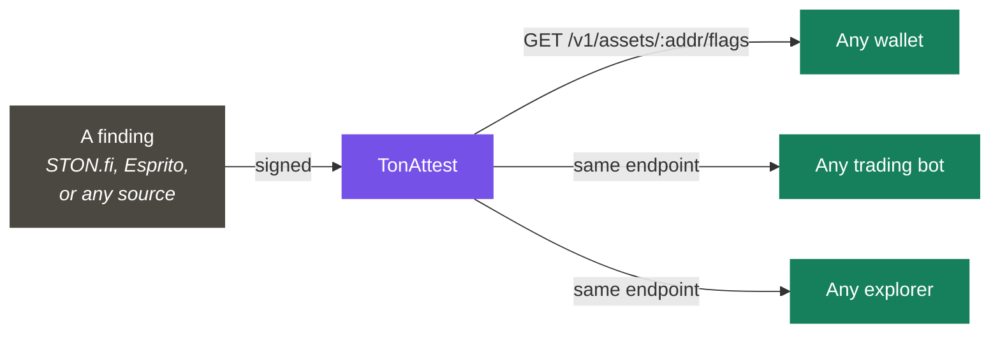

# Asset Trust Layer — Overview

**Status: proposed, not yet built.** Raised directly by STON.fi on a grant
discovery call: could the same attestation mechanism that verifies reward
claims also make token-safety data — honeypots, scams, blacklists — readable
by every wallet and bot in the ecosystem, not just STON.fi's own UI? Full
write-up: [Grant Reapplication](../reference/grant-reapplication.md).

Right now STON.fi flags malicious tokens — honeypots, scams, blacklisted
contracts — but that data lives **only in STON.fi's own UI.** No wallet,
trading bot, or explorer in the TON ecosystem can read it. Each one either
builds its own detection or has none.

That's not a detection problem — good detection already exists. **Esprito
Protocol's TSA** ([github.com/espritoxyz/tsa](https://github.com/espritoxyz/tsa))
does genuinely sophisticated static analysis: it reads compiled contract
bytecode and uses *symbolic execution* — exploring every possible code path
with placeholder values — to catch honeypot patterns and TVM-level bugs. It's
open source and it works. **What's missing is a portable, verifiable way to
publish and consume a finding, from any source, across the ecosystem.**

That's a distribution problem, and distribution is exactly what an
attestation is for.

> *"Right now we just have the asset flags... shown only on STON.fi UI. So
> what I was speaking about is the thing which can **share** [them] with all
> the wallets."* — Michael, STON.fi marketing, on the discovery call, when
> asked directly whether this should work *"in unison"* with Esprito.

## What it makes possible

| Consumer | What they get, without building anything themselves |
|---|---|
| A wallet (Tonkeeper, MyTonWallet, …) | A warning before a user swaps into a flagged token |
| A trading bot | An automatic refusal to route through a flagged asset |
| STON.fi | Its existing flags become portable and citable, correctly attributed, instead of trapped in one UI |
| Esprito (or any detector) | Findings become distributable without duplicating anyone's detection engine |

**What this is not:** a second honeypot detector. Esprito already built that
— symbolic execution over TVM bytecode is a real specialty, and rebuilding it
would be wasted effort and a needless collision with an existing STON.fi
partner. This is the layer that makes *any* detector's output portable.

## Next

* [How It Works](how-it-works.md) — the attestation shape and the publish/query/revoke mechanism
* [Liability & Pricing](liability-and-pricing.md) — why this stays a courier, never a judge, and why it can be cheap
* [Build Plan](build-plan.md) — Phases 5–8
