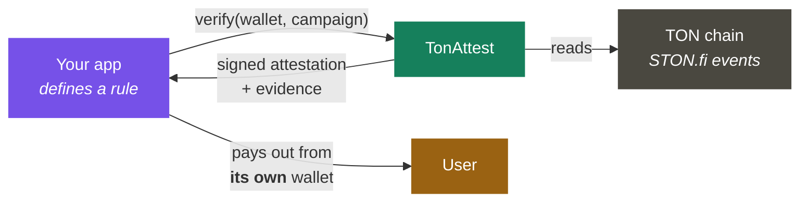
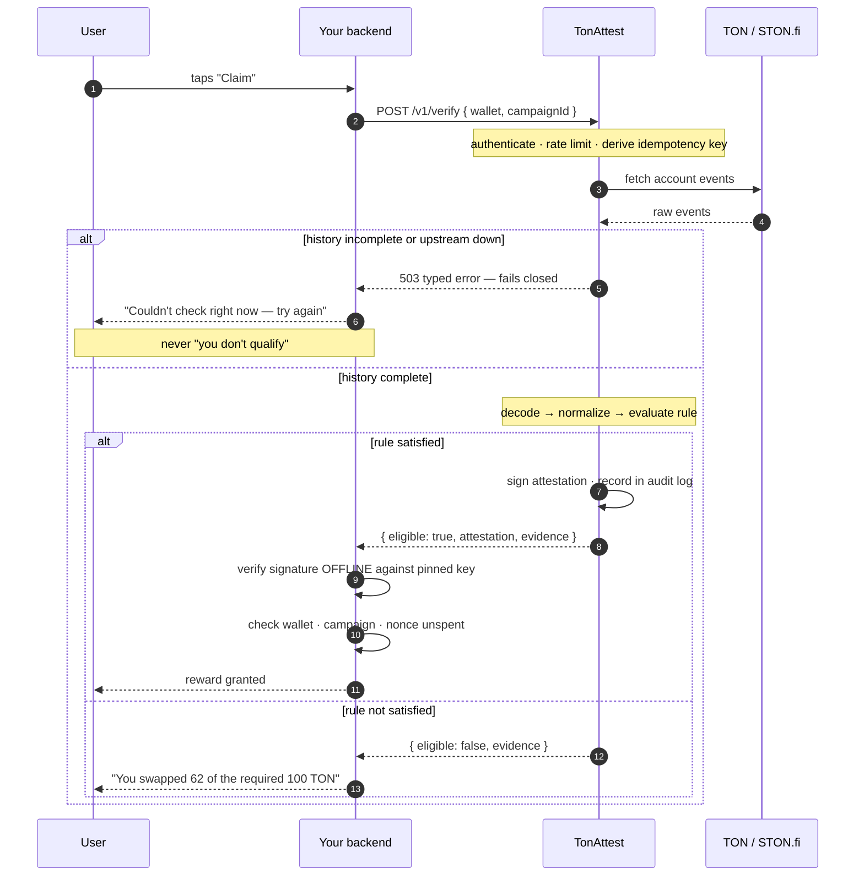

# Architecture

The same mechanism either application runs on: TonAttest reads a fact, signs it, and hands back a proof your app checks itself.

> **No custody. No smart contract. No token.**
> TonAttest proves *what happened on-chain* and signs that statement.
> Your app decides what the reward is and pays it from its own wallet.

## How it works

**Step 9 is the one that matters.** Your app checks the signature itself,
against a public key it pinned at deploy time. A spoofed response, a hijacked
DNS record, or a fully compromised TonAttest instance cannot mint rewards from
your treasury — which is also why hosted and self-hosted have the same security
story.

### Failure is never a wrong answer

If a wallet's history cannot be resolved completely — upstream outage, rate
limit, or a history larger than the fetch cap — TonAttest returns a typed `503`
rather than evaluating partial data. An under-counted history produces a
confident *"you don't qualify"* for someone who did.

> A false negative is a support ticket. A **false positive is a payout you
> cannot claw back.** Every ambiguous case in this system resolves toward the
> former.

---

