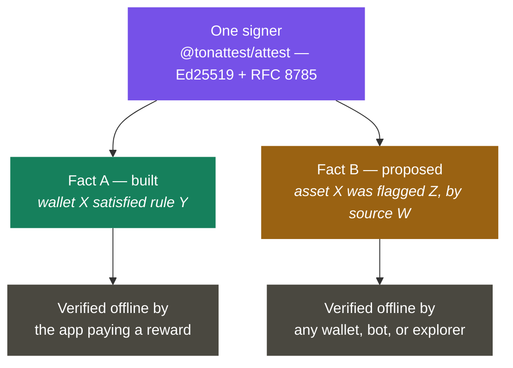
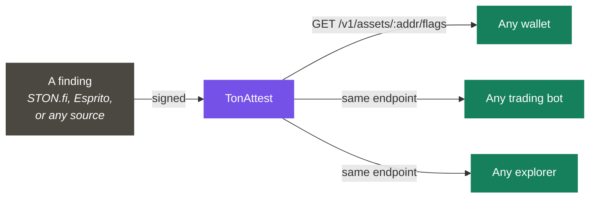
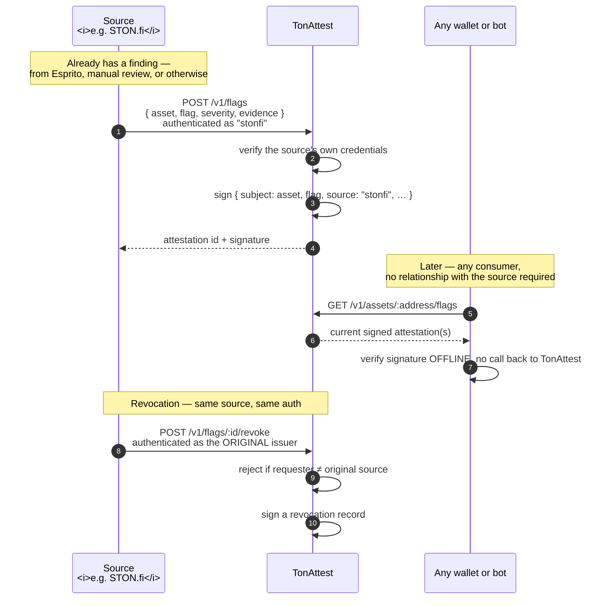

# TonAttest — Grant Reapplication: The Attestation Trust Layer

**Version:** 0.2 (reapplication)
**Prepared for:** STON.fi Grant Program — following the discovery call with Ethan Clime (Head of Developer Relations) and Michael (Marketing)
**Status:** Concept extension of an already-built, tested product
**Prior application:** Campaign verification / reward-rule attestations (v0.1) — that product is built, tested against live mainnet, and remains the foundation this proposal extends

---

## 1. What changed since the last application

The original TonAttest pitch was narrow by design: let any app define a reward rule ("swap 100 TON on STON.fi") and get back a signed, offline-verifiable proof that a wallet satisfied it. That product exists today — decoder, rules engine, signed attestations, an SDK, 360 tests, verified against live mainnet transactions.

On the discovery call, Michael raised a different, larger problem that STON.fi already has and currently solves alone, internally, for itself only:

> STON.fi flags malicious tokens — honeypots, scams, blacklisted contracts — on its own site. Nobody else in the TON ecosystem shares this data. Not Tonkeeper, not MyTonWallet, not trading bots. Each wallet either builds its own detection or has none at all.

Ethan's ask was direct: would TonAttest pivot toward becoming the **distribution layer** for this kind of trust signal, ecosystem-wide, rather than staying scoped to campaign rewards?

This document is that pivot, written up as requested.

When Ethan directly asked Michael to clarify scope — *"are you imagining
this as an additional layer that works in unison [with Esprito]?"* —
Michael's answer settled it:

> *"Right now we just have the asset flags... shown only on STON.fi UI. So
> what I was speaking about is the thing which can share [them] with all
> the wallets."*

That is the scope this document commits to: **sharing findings that already
exist, not producing new ones.**

## 2. The gap, researched

Before proposing anything, we looked at what actually exists today.

**STON.fi's own tagging** is real but closed: flags are attached to assets internally and shown only in STON.fi's own UI.

**Esprito Protocol** (the vendor STON.fi named on the call) builds **TSA — the TON Symbolic Analyzer** ([github.com/espritoxyz/tsa](https://github.com/espritoxyz/tsa)), a genuinely sophisticated static-analysis tool. It reads compiled contract bytecode (BoC format) and uses **symbolic execution** — exploring every possible code path with placeholder values instead of real ones — to detect honeypot patterns, integer overflow, division-by-zero, and other TVM-level bugs. It is open source, MIT-licensed, and built as a CLI/library, not a live queryable service.

**The actual gap is not detection — it's distribution.** A finding produced by STON.fi's process, or by a tool like TSA, has no standard, portable, verifiable form that a *different* company — a wallet, a bot, an explorer — could consume and trust without either re-running the analysis themselves or blindly trusting a second party's API.

That gap — a signed, revocable, offline-verifiable statement of "this asset is flagged, here's why, here's who said so" — is structurally identical to the attestation primitive TonAttest already built for campaigns. We are not proposing to compete with Esprito's detection work. We are proposing to be the layer that makes any detector's output portable across the ecosystem.

## 3. Why this is an extension, not a rebuild

TonAttest's core mechanism was never really "verify campaign rules." That's one *use* of a more general capability:

> Take a fact about the chain. Sign it, so it can't be forged. Let anyone check that signature themselves, offline, without trusting a live API call. Allow it to be revoked later, and let the revocation itself be checked the same way.

Today the fact is `{ wallet, campaign, eligible: true }`. This proposal adds a second fact shape:

```json
{
  "v": 1,
  "subject": "asset",
  "address": "0:8cdc1d76...",
  "flag": "honeypot",
  "severity": "high",
  "source": "stonfi",
  "evidence_url": "https://...",
  "issued_at": 1755300000,
  "revoked_at": null
}
```

Signed with the same Ed25519 mechanism. Verified offline with the same public-key model already documented in the [attestation spec](../tonattest/docs/attestation-spec.md). The signer, the canonicalization, the SDK's `verifyAttestation()` — all reusable without modification. What's new is the *subject* of the attestation (an asset, not a wallet-campaign pair), a public read endpoint, and a real revocation lifecycle.



## 4. What this makes possible



- **Any wallet** (Tonkeeper, MyTonWallet, others) could check `GET /v1/assets/{address}/flags` before rendering a swap screen and show a warning — without building or licensing their own detection pipeline.
- **Any trading bot** could refuse to route through a flagged token automatically.
- **STON.fi's own flags become portable** — instead of living only in STON.fi's UI, they become a citable, independently-checkable fact any downstream consumer can rely on, with STON.fi correctly credited as the source.
- **Esprito's findings become distributable** the same way, if they choose to publish through this layer, without us duplicating their detection engine.
- **Flags are revocable, properly** — a false positive doesn't require deleting a record and hoping nobody screenshots stale data; a revocation is itself a signed, checkable event.

## 4b. Attribution, not adjudication — the liability boundary

Every attestation states **"source X claims Y about this asset,"** never
**"Y is true."** The `source` field in §3's schema is not decoration — it is
the entire boundary between "we relayed a fact" and "we made a judgment
call." TonAttest never independently determines whether a token is
malicious; it signs and publishes a determination someone else already made,
with their name attached and their accountability intact.

The same boundary holds on revocation: **only the issuing source can revoke
its own flag.** TonAttest does not unilaterally decide a flag was wrong —
doing so would itself be an independent judgment call, exactly the exposure
this design avoids. This must be enforced technically (revocation requests
authenticated against the original issuer), not merely stated as policy.

**Why this can be priced affordably, including for the trading-bot segment
Ethan named as currently priced out:** the expensive step — reading a
contract's bytecode and proving it's a trap — happens once, ever, per token.
After that, checking whether a token is flagged is a database lookup, not an
analysis. TonAttest never re-runs anyone's detection; it serves an
already-computed result. That is the entire cost-structure difference that
makes this affordable where direct detection access is not — and it only
works honestly if what's being served is a finding a real source stands
behind, not a repackaged claim with the origin stripped off.

## 5. Build plan

The mechanism these phases build, concretely:



Submitting a flag requires authenticating as a real, named source — nobody
can flag an asset anonymously or on TonAttest's own authority. Revoking one
requires authenticating as that *same* source, enforced by the service
itself rather than left as a policy anyone has to trust.

Phased the same way the original delivery was — each phase ends in something independently useful, so partial completion still leaves value behind.

| Phase | Delivers | Builds on |
|---|---|---|
| **5 — Attestation schema extension** | A second attestation *kind* (`subject: "asset"`) alongside the existing campaign kind; canonicalization, signing, and offline verification extended and tested the same way the original was | `@tonattest/attest`, `@tonattest/rules` — no rework, additive types |
| **6 — Ingestion + publishing API** | Endpoints to submit a flag (authenticated, source-attributed) and to query current flags for an asset, including revocation history | `@tonattest/service` — same Fastify app, new routes, same auth/rate-limit/audit-trail machinery already built |
| **7 — Revocation lifecycle** | Formal revoke flow, authenticated to the original issuing source only; a revocation is itself signed and checkable, distinct from silent deletion | Existing `attestations` table + audit log |
| **8 — Distribution & pilot integration** | A reference integration (e.g., a lookup widget, or a direct pilot with a named wallet/bot) showing a real consumer checking a real flag, offline | New — the "prove it end to end" phase, mirroring how Phase 1 was proven against live mainnet data |

## 6. What we are explicitly not proposing

- **We are not building a second honeypot detector.** Symbolic execution over TVM bytecode is a real specialty; Esprito has already done that work. Rebuilding it would be wasted effort and a direct, needless collision with an existing STON.fi partner.
- **We are not asking to replace STON.fi's internal flagging process.** The proposal is to make its *output* portable, with STON.fi (or any source) correctly attributed — not to intermediate or gatekeep STON.fi's own judgment calls.
- **We are not abandoning the campaign-verification product.** It is built, tested, and STON.fi's own mid-September usage-tracking campaign is a live near-term opportunity for exactly that product, independent of this proposal.

## 7. Revenue model

Discussed on the call and unchanged by this pivot: **usage-based, pay-as-you-go by API call volume** — a rate-limited free tier for evaluation, then metered pricing beyond it. This applies identically to both attestation kinds (campaign and asset-flag), since both run through the same request-metered service. Real infrastructure costs that scale with usage — tonapi.io fetch costs, Postgres/Redis hosting — are the reason a free-forever tier isn't viable at scale, and were named honestly on the call rather than glossed over.

## 8. Budget

| Item | Amount | Deliverable |
|---|---|---|
| Attestation schema + signing extension (Phase 5) | $1,200 | Tested, additive change to the existing pure `rules`/`attest` packages |
| Ingestion + publishing API (Phase 6) | $1,500 | New service endpoints, reusing existing auth/rate-limit/audit infrastructure |
| Revocation lifecycle (Phase 7) | $800 | Signed revocation flow, tested against the same concurrency/fail-closed standards as the existing service |
| Pilot integration + distribution (Phase 8) | $1,500 | A real, working consumer of a real flag — the "proof it works" moment for this phase, same bar as the mainnet decoder proof in the original build |

**Total: $5,000** — unchanged from the original ask; reallocated toward this extension rather than toward closing the original product's remaining documented gaps (fixture coverage, historical pricing), which remain lower-risk and can proceed in parallel at lower cost.

## 9. What we're asking STON.fi for, beyond funding

- **Introductions** — to the internal team maintaining STON.fi's current flag data, so Phase 6's ingestion API is designed against real data shape from day one rather than guessed at
- **A named pilot partner** — a wallet or bot willing to be the first real consumer for Phase 8, the same way STON.fi's own September campaign is the natural first pilot for the original product
- **Feedback on the schema in §3** before Phase 5 begins, since getting the attestation shape right early avoids a breaking change later

## 10. Honest status

Everything above Phase 4 in this document is **proposed, not built.** The reused pieces — the signing mechanism, offline verification, the service's auth and rate-limiting — are real, tested, and already proven at 360 passing tests against live mainnet data, which is why this extension is lower-risk than a from-scratch build. But the asset-flag attestation kind, the publishing API, and the revocation lifecycle do not exist yet. This document is the plan to build them, not a claim that they're done.
